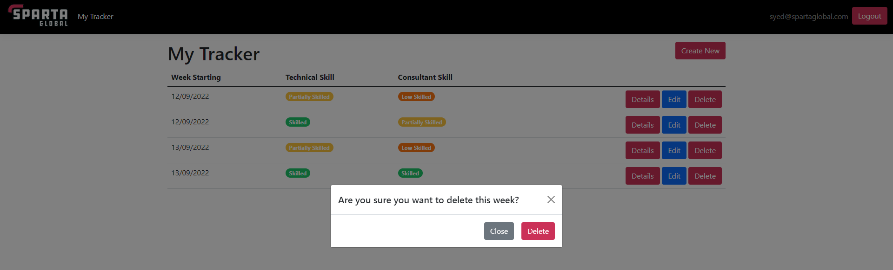
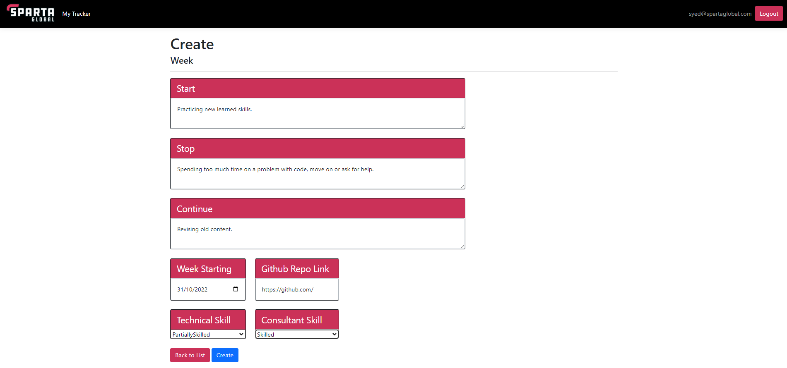
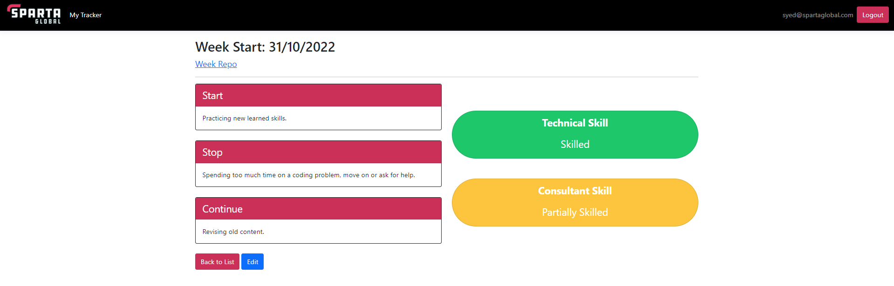
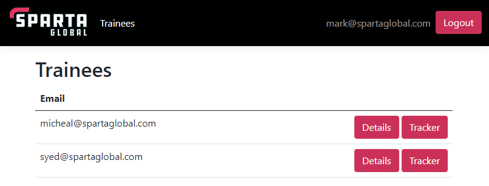
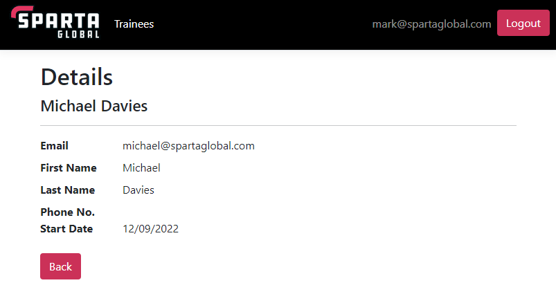
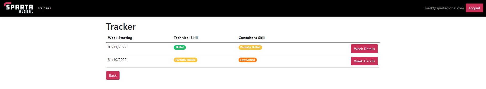
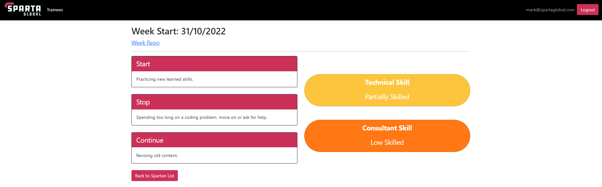
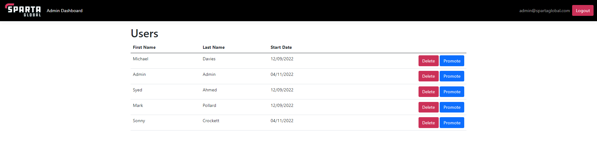
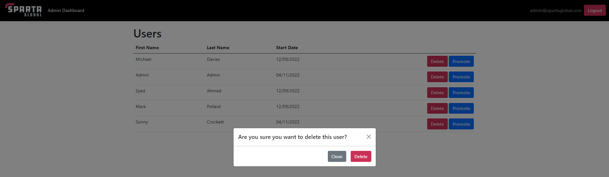
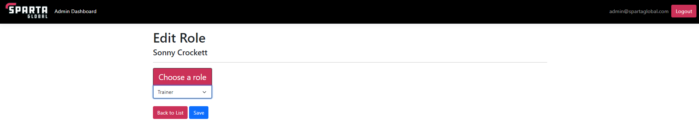

# Sparta Global - Trainee Tracker Group 1

## Group Members
Adam Reed  
Jai Bharat Kothari  
Mark William Pollard  
Michael Bonardi Davies  
Robert Green  
Syed Ahmed  
Tudor Ionut Biragau  
William Stickler  

---
<br>

## Table Of Contents
- [Overview](#overview)
- [Getting Started](#getting-started)
- [The Design Process](#the-design-process)
- [How To Use The Website](#how-to-use-the-website)
- [Approach to Testing](#approach-to-testing)
- [API Documentation](#api-documentation)
    - [Operations](#operations)
    - [Paths](#paths)

---
<br>

## Overview
This repository contains the final project for the Sparta Global C# Development Stream "Engineering 128 & 151" group 1. The aim of this project is to use ASP.NET Core to create a Web App and an API.

## Getting Started
Clone the repo 

```
git clone https://github.com/GitAdamReed/SpartaTraineeTrackerGroup1.git
```
Open up the project in Visual Studio and in the package manager console run
```
drop-database

update-database
```
Click on run and the project will open in your default browser

## The Design Process

### Overall Design

The website takes quite a simplistic look, with the main colours being black and white, accompanied by Sparta Global themed colours. This was chosen as to not overwhelm the user with a large array of different colours.

### Buttons


The button colour scheme mainly adheres to a Sparta Global theme, apart from buttons which result in important functionality when clicked, such as the Edit button.

All buttons on the site also have "fading" effect when you hover over them. This was put in place to increase ease-of-use of the site. They also indicate important operations such as with the Delete button, which will transition to Dark Red when the user hovers over it to warn the user that this is a dangerous action.

## How To Use The Website

### Trainee
**INDEX PAGE:**

When logged in, a trainee will see an index page of their weeks. If it is a new user, there will be no weeks and the only option available to them will be to create a new week. The trainee can see each week's start date and a summary of their skill level in each category. They also have details, edit and delete buttons available to them. The details button will direct them to a page listing the information of that week. The edit button will direct them to a page where they can edit that specific week's details. The delete button will not direct them to a page, but instead display a prompt asking if they are sure they want to delete the selected week. If a new week is to be created, a trainee can click the create new button, where they will be directed to a create page.



**CREATE PAGE:**

On the create page, a user can enter text for the start, stop and continue categories. They can also use a calendar view to select when the week starting, add a link to the respective week's repository and use the drop down to select a skill level for both categories. If they reached this page by accident or do not wish to create a new week, they can click the back to list button to return to the index page. The create button will add the week and the information entered to the database, and direct the trainee back to the index page where they will see the week added.


**DETAILS PAGE:**

This page allows the user to view the details of a chosen week. It displays the week start, a link to the repository of that week the user can click, and the information for the start, stop, contoinue and skills categories. From here the user can click back to list to return to the index page, or click edit to be taken to the edit page for the week displayed.


**EDIT PAGE:**

The edit page is functionally similar to the create page, as data can be entered by the trainee, but data from the existing week they wish to edit will appear and they can alter it. The back to list button is here again incase the user got to the page by accident or no longer needs to edit the week. The save button will change the data for the selected week and update the database. This button will then direct them to the details page of the week they edited so they can see the changes.


### Trainer
**INDEX PAGE:**

When logged in, a trainer will see a list of all trainees. For each trainee, they can view their details or tracker by clicking the respective buttons. On clicking the details button, they are directed to the details page. When the tracker button is clicked they are directed to the tracker page to view their weekly reflectives.



**DETAILS PAGE:**

On the details page, a trainer can see all necessary information on the trainee, including name and email. The trainer can then click the back button when finished viewing the details, which will bring them back to the index page.


**TRACKER PAGE:**

When viewing the tracker page, a trainer can see the weekly reflectives of the trainee they selected and a small summary of the skill level they have placed themselves at. They can also click the week details button to view all information of a specific week reflective. A trainer can click back to list to return to the index page.


**WEEK DETAILS PAGE:**

On the week details page, a trainer will see the start, stop and continue categories and the information a trainee has added to them, as well as the skill level they feel they are at for the technical and consultant categories. A link to the trainee's repository of that week can be clicked to bring the user to the repository page, if the trainee had provided the link when filling out that weeks reflective. When done viewing, a trainer can click back to list to return to the index page.


### Admin
**INDEX PAGE:**

When logged in, the admin will be directed to the spartans view page where they can see all user accounts.



From here they are able to either delete or change the role of the users by clicking the respective buttons. The promote button will direct the admin to a new page, while the delete button will display a prompt. This is to prevent accidental deletion of users. Here the admin can either commit to deleting the user by clicking the delete button, where the user will be removed from the database permanently. They can alternatively click "Close" if deletion is not intended and the prompt is closed.


**ROLE PAGE:**

The promote page displays a dropdown menu where the admin can select the role they wish to change the user to. Once selected and the save button has been clicked, the database will update the user's role and the admin will be taken back to the index page. The admin can also go back to the index page if necessary using the back to list button. 


## Approach to Testing
Me (Michael) and Syed's first port of call with testing was to begin testing at the service level before testing the controllers that contains their dependencies.
Our approach to testing the service layers was to setup an in-memory databse that service tests could safely perform CRUD methods on.

One difficulty that we encountered forming these tests was that so many tests which create and delete entities simultaneously can affect each others' entities, so we had to be very
careful to ensure each tests' dependence. One test that unexpetedly threw a spanner in the works was a test that checks for a thrown DbUpdateConcurrencyException, it unexpectedly broke
two other tests performing delete operations when running all three together. Given more time we would have liked to have been able to find a way to run it concurrently with the rest of the
test set.

Once we were happy with the tests we formed for the Service layers, we moved on to using MOQ to test our controllers. We soon discovered that due to the dependencies on HttpContext in the Week Controller,
we had to configure the controller context in our tests. The method for this was not immediately obvious from research, and it took a lot of trial and error to configure correctly. Given more time, we would
have liked to have refactored our controllers' dependencies on UserManager into our service layers.

After this, another layer of complexity presented itself when I tackled testing the HomeController, which uses conditional logic to test whether a user is in a particular role. For this, the documentation
around configuring HttpContext roles is even more arcane, and it took a lot of Stack Overflow perusal to achieve correctly. The HomeControllerTests, with all its mocked dependencies and configurations, serves as
the crown jewel of my test suites.

If the code were to be refactored, certain repeated mock setups could be refactored as custom test class methods, and coverage can be expanded in certain areas, namely the TraineeController that
was introduced late into development.

## API Documentation
### Consumes
`application/json`

### Produces
`application/json`

## Operations
[getWeeks](#get-weeks)<br>
[createWeek](#post-weeks)<br>
[getWeek](#get-weeksid)<br>
[updateWeek](#put-weeksid)<br>
[deleteWeek](#delete-weekid)<br>
[getUsers](#get-users)

## Paths
### GET /Weeks
#### Operation: getWeeks
#### Description
Returns a list of all weeks available to the user that is accessing it.
#### Parameters

| Type          | Name          | Description   | Schema        |
| ------------- | ------------- | ------------- | ------------- |
| Header        | Access-Token  |This is a _required_ parameter |string|
#### Response
```json
{
    "link": {
        "self": "https://localhost:7147/api/Weeks"
    },
    "data": [
        {
            "id": 1,
            "start": "Revising for tests",
            "stop": "Being lazy",
            "continue": "Practicing Agile",
            "weekStart": "2022-09-12",
            "gitHubLink": "",
            "technicalSkill": "PartiallySkilled",
            "consultantSkill": "LowSkilled"
        },
        {
            "id": 4,
            "start": "Doing Homework",
            "stop": "Getting distracted by my cat",
            "continue": "Practicing API's",
            "weekStart": "2022-09-12",
            "gitHubLink": "",
            "technicalSkill": "Skilled",
            "consultantSkill": "PartiallySkilled"
        },
        ...
    ]
}
```

### POST /Weeks
#### Operation: createWeek
#### Description
Creates a week assigned to the user accessing it.
#### Parameters

| Type          | Name          | Description   | Schema        |
| ------------- | ------------- | ------------- | ------------- |
| Header        | Access-Token  |This is a _required_ parameter |string|
| Body          | start         |This is an _optional_ parameter|string|
| Body          | stop          |This is an _optional_ parameter|string|
| Body          | continue      |This is an _optional_ parameter|string|
| Body          | weekStart     |This is an _optional_ parameter|date|
| Body          | gitHubLink    |This is an _optional_ parameter|string|
| Body          | technicalSkill|This is an _optional_ parameter|enum|
| Body          | consultantSkill|This is an _optional_ parameter|enum|
#### Response
```json
{
    "link": {
        "self": "https://localhost:7147/api/Weeks"
    },
    "data": {
        "id": 8,
        "start": "Playing Bobble League",
        "stop": "Getting distracted by my cat",
        "continue": "Making awesome ReadMe's",
        "weekStart": "2022-11-04",
        "gitHubLink": "",
        "technicalSkill": "Unskilled",
        "consultantSkill": "Unskilled"
    }
}
```

### GET /Weeks/{id}
#### Operation: getWeek
#### Description
Returns a single week for the given id.
#### Parameters

| Type          | Name          | Description   | Schema        |
| ------------- | ------------- | ------------- | ------------- |
| Header        | Access-Token  |This is a _required_ parameter |string|
| Path          | {id}          |This is an _optional_ parameter|string|
#### Response
```json
{
    "link": {
        "self": "https://localhost:7147/api/Weeks/5"
    },
    "data": {
        "id": 5,
        "start": "Playing Bobble League",
        "stop": "Getting distracted by my cat",
        "continue": "Making awesome ReadMe's",
        "weekStart": "2022-09-13",
        "gitHubLink": "",
        "technicalSkill": "Skilled",
        "consultantSkill": "Skilled"
    }
}
```

### PUT /Weeks/{id}
#### Operation: updateWeek
#### Description
Returns a list of all customers but can be filtered with parameters.
#### Parameters

| Type          | Name          | Description   | Schema        |
| ------------- | ------------- | ------------- | ------------- |
| Header        | Access-Token  |This is a _required_ parameter |string|
| Path          | {id}          |This is an _optional_ parameter|string|
| Body          | start         |This is an _optional_ parameter|string|
| Body          | stop          |This is an _optional_ parameter|string|
| Body          | continue      |This is an _optional_ parameter|string|
| Body          | weekStart     |This is an _optional_ parameter|date|
| Body          | gitHubLink    |This is an _optional_ parameter|string|
| Body          | technicalSkill|This is an _optional_ parameter|enum|
| Body          | consultantSkill|This is an _optional_ parameter|enum|
#### Response
```json
{
    "link": {
        "self": "https://localhost:7147/api/Weeks/5"
    },
    "data": {
        "id": 5,
        "start": "Playing Bobble League",
        "stop": "Getting distracted by my cat",
        "continue": "Making awesome ReadMe's",
        "weekStart": "2022-09-13",
        "gitHubLink": "https://github.com/SyedAhmed98",
        "technicalSkill": "Skilled",
        "consultantSkill": "Skilled"
    }
}
```

### DELETE /Week/{id}
#### Operation: deleteWeek
#### Description
Returns a list of all customers but can be filtered with parameters.
#### Parameters

| Type          | Name          | Description   | Schema        |
| ------------- | ------------- | ------------- | ------------- |
| Header        | Access-Token  |This is a _required_ parameter |string|
| Path          | {id}          |This is an _optional_ parameter|string|
#### Response
```json
{
    "link": {
        "self": "https://localhost:7147/api/Weeks/10"
    },
    "status": "success",
    "message": "Week has been deleted"
}
```

### GET /Users
#### Operation: getUsers
#### Description
Returns a list of all customers but can be filtered with parameters.
#### Parameters

| Type          | Name          | Description   | Schema        |
| ------------- | ------------- | ------------- | ------------- |
| Header        | Access-Token  |This is a _required_ parameter |string|
#### Response
```json
{
    "link": {
        "self": "https://localhost:7147/api/Users"
    },
    "data": [
        {
            "email": "micheal@spartaglobal.com",
            "firstname": "Michael",
            "lastname": "Davies",
            "startDate": "2022-09-12",
            "weeksCount": 3,
            "roles": [
                "Trainee"
            ]
        },
        {
            "email": "syed@spartaglobal.com",
            "firstname": "Syed",
            "lastname": "Ahmed",
            "startDate": "2022-09-12",
            "weeksCount": 4,
            "roles": [
                "Trainee"
            ]
        }
    ]
}
```
